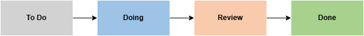
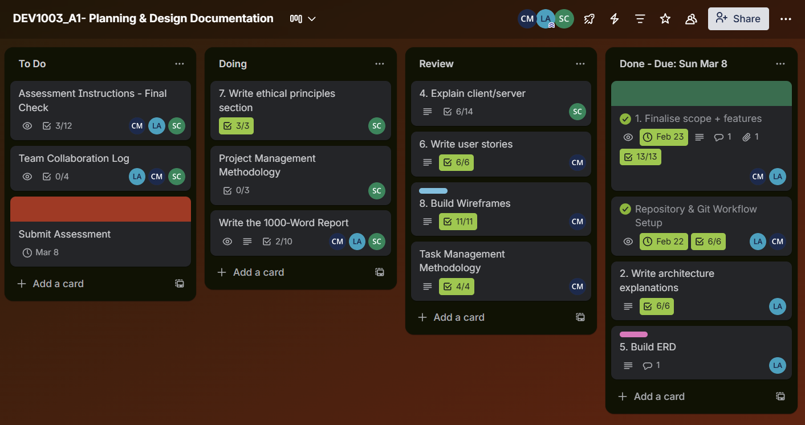

# Planning & Design Documentation

## DEV1003 - Advanced Applications - Assessment 1

### Courtney - Lorena Borges Amaral - Simona Chiapperino

# MERN Project - Guild Availability Management System (GAMS)

## 1. Project Overview

The **Guild Availability Management System (GAMS)** is developed using an Object‑Oriented Programming (OOP) paradigm, where core entities will be modelled as objects with their own state and behaviour. The application follows a Model–View–Controller (MVC) architecture, separating data management, business logic, and user interface into clear layers that improve maintainability and scalability.  
As a MERN application, it will operates on a client/server model, with the React client handling user interactions while the Express/Mongoose server processes requests, applies business rules, and communicates with the MongoDB database.  
The project is managed using Agile principles, supporting iterative development, continuous feedback, and adaptability as requirements evolve. Task organisation is structured through a Kanban workflow, providing visibility of progress and enabling efficient team collaboration.  
Throughout development, the system adheres to ethical principles, prioritising user privacy, transparency, accessibility, and responsible handling of data to ensure a trustworthy and user‑centred application.

## 2. Software architecture

### 2.1 Programming paradigm: Object‑Oriented Programming (OOP)

The Object‑Oriented Programming (OOP) paradigm appears naturally in this project through the way Mongoose structures and manages data. In OOP, a _class_ defines what an object should look like, and each _object instance_ represents a real, individual item with its own data and behaviour. Mongoose follows this same pattern.

When we define an `Item` schema with fields such as `name`, `description`, `stock_qty`, `created_at`, and `updated_at`, we are creating a blueprint that describes the state of every Item object in the system. Compiling this schema into a Mongoose model is similar to defining a class in traditional OOP: the model becomes the constructor used to create new Item objects. This reflects core OOP principles: encapsulation, where data and behaviour are grouped together inside the same object, and responsibility boundaries, where each Item object manages its own rules rather than relying on external code.

#### Example 1 - Simplified Object with data + behaviour (OOP encapsulation)

```javascript
const item = {
  name: 'Ancient Sword',
  description: 'A rare blade used by guild champions.',
  stock_qty: 3,
  isAvailable() {
    return this.stock_qty > 0;
  },
};
```

This example demonstrates the core OOP idea of encapsulation: the object stores its own data (state) and the function that operates on that data (behaviour).

#### Example 2 - Mongoose Model With a Simple Method (Real MERN OOP)

```javascript
const itemSchema = new mongoose.Schema({
  name: String,
  description: String,
  stock_qty: Number,
  created_at: Date,
  updated_at: Date,
});

itemSchema.methods.isAvailable = function () {
  return this.stock_qty > 0;
};
```

Here, the model acts like a class, and each document created from it becomes an object instance with its own state and behaviour. The method `isAvailable()` belongs to the object and uses its own data, demonstrating OOP responsibility boundaries.

#### Example 3 - Controller Using Object Behaviour (Abstraction)

```javascript
if (!item.isAvailable()) {
  return res.status(400).json({ message: 'Item not available' });
}
```

The controller does not calculate availability itself. Instead, it asks the object to perform the check. This is OOP abstraction, where internal logic is hidden inside the object.

#### 2.1.1 Object‑Oriented Programming Diagram - Planning and Design Version

<center>  </center>

_Fig 1. Example Object‑Oriented Programming Diagram for an Item entity, Image created by the team using draw.io._

### 2.2 Software architecture pattern: Model–View–Controller (MVC)

The application follows a Model–View–Controller (MVC)‑inspired architecture layered over a MERN stack.

<center>  </center>

_Fig 2. Generic Model–View–Controller Diagram, Image from Ed Lessons website_

The Model layer (Mongoose schemas and domain logic) represents entities such as `User`, `Item`, and `Contract`. The Controller layer (Express controllers) coordinates requests, applies business rules, and interacts with models. The View layer will be implemented in React, consuming the backend’s REST API and rendering the user interface for dashboards, lists, and detail views.

#### 2.2.1 How MVC Maps to the MERN Stack

<center>  </center>

_Fig 3. High Level Structure Model–View–Controller Diagram, Image created by the team using draw.io._

- **View (React Frontend)**: Displays data to the user and sends requests to the backend. Example: Item list page, Contract details page.
- **Controller (Express.js)**: Receives HTTP requests, calls the appropriate model methods, and returns responses. Example: `itemController.js`, `contractController.js`.
- **Model (MongoDB + Mongoose)**: Defines the structure of data and encapsulates business logic. Example: `Item`, `User`, `Contract` models.

#### 2.2.2 Example of How MVC Will Be Applied in This Project

##### Scenario: A user wants to reserve an item

1. View (React): The user clicks “Reserve” on the Item Details page. React sends a request: `POST /items/123/reserve`
2. Controller (Express): The `reserveItem` controller receives the request. It loads the Item object and calls its OOP method: `item.isAvailable()`
3. Model (Mongoose): The Item object checks its own state (`stock_qty`). If available, it updates itself and saves to MongoDB.
4. Response: The controller sends a success or error message back to React. React updates the UI accordingly.

<center>  </center>

_Fig 4. MVC Applied in GAMS project Diagram, Image created by the team using draw.io._

## 3. Development methodologies

### 3.1 Project management methodology: Agile

The team developed the Guild Availability Management System (GAMS) using an Agile project management approach. Agile supported the project by encouraging iterative development, regular communication, and flexibility throughout the planning and design process. Rather than treating the project as a single fixed task, the team developed the work progressively and reviewed sections as the project moved forward.

This approach helped the team respond to changing requirements and improve documentation throughout development. As the team completed different sections, members could review the work, identify issues, and make adjustments before moving on to the next stage. It reduced the risk of leaving major problems until the end of the project.

Agile also supported collaboration between team members. The team communicated regularly, shared progress updates, and clarified responsibilities while different parts of the assessment were being completed. It made it easier to keep the project aligned and ensure that all required components were being addressed.

Another advantage of Agile in this project was its focus on incremental progress. The team could complete one part of the assessment at a time, review it, and then continue building on that work. It was especially useful for a project that included different elements such as system explanations, diagrams, ethical principles, ERD design, and user stories.

For example, the team worked on the client/server architecture section in several steps. A team member first wrote the explanation, then created the supporting diagrams, and finally the section was reviewed before being added to the final document.

This workflow helped the team organise development tasks clearly, track project progress visually, and coordinate collaboration across the project. Kanban boards support task visualisation and workflow management in Agile software development (Atlassian, 2023).

### 3.1 Project management methodology: Agile

### 3.2 Task management methodology: Kanban

For task management, the team will use the Kanban methodology to organise and track project tasks throughout the development of the Guild Availability Management System. Kanban focuses on visualising work and moving tasks through different stages of completion using a board and task cards. This approach allows the team to clearly see what work needs to be completed, what is currently in progress, and what tasks have already been finished.

A Trello board will be used to implement the Kanban workflow. The board will be divided into four columns representing the different stages of work:



_Fig 5. Kanban task workflow used for managing project tasks, Image created by the team using draw.io._

- To Do – tasks that have been identified but not yet started
- Doing – tasks that a team member is currently working on
- Review – tasks that have been completed and require checking by another team member
- Done – tasks that have been reviewed and approved as complete

Each task will be represented by a card on the board. Cards may include descriptions, checklists, and assigned team members so responsibilities are clearly defined. At the start of the project, tasks will be divided between team members based on the project requirements and areas of responsibility.

The team will collaborate using Trello, Discord, and GitHub. Trello will be used to track progress and manage tasks, Discord will support communication and discussion between team members, and GitHub will be used for version control and code collaboration through feature branches and pull requests.

For example, a task such as “Build Wireframes” will be created as a card on the Trello board with a checklist of required pages and device types. As work progresses, checklist items will be marked as completed and the card will move through the workflow stages from To Do → Doing → Review → Done.

Using Kanban will provide a clear overview of project tasks and help ensure that work progresses in an organised and transparent manner throughout the development process.



_Fig 6. Trello Kanban board used by the team to organise and track project tasks through the workflow stages To Do, Doing, Review, and Done. Screenshot taken from the project Trello board._

Additional screenshots of the Trello board at different stages of the project are included in the [Trello folder](Trello/) of the repository.

## 4. Client/server explanation

The Guild Availability Management System (GAMS) follows a client–server architecture implemented using the MERN stack (MongoDB, Express, React, Node.js). This architecture separates responsibilities between the frontend and backend to improve maintainability, scalability, and security.
In this model, the React application acts as the client. It runs in the user’s browser and is responsible for rendering the user interface, handling user interactions, and sending HTTP requests to the backend API.
The Express application acts as the server. It receives incoming requests, applies business logic, validates data, enforces authorisation rules, and communicates with MongoDB through Mongoose models.
MongoDB serves as the persistent data layer. It stores core entities such as Users, Items, Contracts, Reservations, Watchlists, and Notifications. All permanent system data is managed centrally through the backend, ensuring data integrity and preventing direct client access to the database.
This separation ensures that the frontend focuses on presentation and usability, while the backend controls system rules and data management.

## 4.1 Client/Server Communication


_Fig 7. Client–server communication flow between the user's browser, the internet network and the application server._

Communication between the client and server follows a RESTful request–response model over HTTP.
The React frontend sends HTTP requests (GET, POST, PUT, DELETE) to API endpoints defined in the Express backend.
Each request follows this process:

1. The client sends an HTTP request to a specific endpoint.
2. The Express router maps the request to the appropriate controller.
3. The controller applies business logic.
4. The controller interacts with the relevant Mongoose model.
5. The model performs database operations in MongoDB.
6. The server returns a structured JSON response.
7. The client updates the interface based on the response.

Because this architecture is stateless, each request contains all the information required to process it. It reduces the server's reliance on session state and supports scalability.

## 4.2 Data Distribution


_Fig 8. Data distribution between multiple clients, the central server and the database._

GAMS centralises all persistent data within MongoDB, which acts as the single source of truth.
The client does not store authoritative system data. Instead, it retrieves data from the backend when needed and updates information only through API requests.
The server manages all database interactions and determines what data can be accessed or modified. Core entities such as Users, Items, Contracts, Reservations, Watchlists, and Notifications are stored in MongoDB and accessed exclusively through the backend.
This approach ensures consistency, prevents client-side manipulation of sensitive information, and maintains overall system integrity.

## 4.3 Feature Distribution

The system distributes features according to responsibility.
The React frontend handles presentation and user interaction. It renders pages such as the item list, item details, contract views, watchlists, notifications, and administrative dashboards. It captures user actions, including reserving an item, accepting a contract, updating stock (admin), or managing watch preferences.
The Express backend enforces business rules and system logic. It processes requests, checks item availability, updates stock quantities, validates contract conditions, generates notifications, and controls access based on user roles.
By keeping decision-making logic on the server, the system prevents users from bypassing rules through client-side manipulation.

## 4.4 Authorisation


_Fig 9. Authentication and role-based authorisation process within the GAMS system._

GAMS uses role-based authorisation to control access to sensitive features.
After authentication, the backend identifies the user and assigns permissions based on their role (for example, regular user or admin).
Regular users can:

1. Browse items and contracts.
2. Reserve available items.
3. Accept contracts within defined conditions.
4. Manage their own watchlist and notifications.

Admin users have additional permissions. They can:

1. Create and edit items and contracts.
2. Update stock quantities.
3. Manage availability settings.
4. Perform administrative management actions.
   The backend enforces these permissions on protected routes. Even if the frontend hides certain interface elements, the server performs the final authorisation check before executing any restricted operation.

## 4.5 Validation

Validation ensures that incoming data meets system requirements before being processed or stored.

### Client-side validation (React)

The React frontend performs basic validation to improve usability. It includes checking required fields, validating simple formats (such as email addresses), and preventing clearly invalid input (such as negative numbers in stock fields).
However, client-side validation is not sufficient for security because users can bypass the interface.

### Server-side validation (Express + Mongoose)

The backend performs final validation before updating the database. The server verifies that:

1. Required fields are present
2. Data types are correct
3. Values comply with business rules (for example, stock_qty cannot be negative)
4. The target record exists.
   Mongoose schema definitions provide additional validation at the model level to maintain data consistency.
   If validation fails, the server returns an appropriate error response and does not modify the database. If validation succeeds, the server completes the request and returns a success response to the client.

## 5. ERD explanation

The Entity Relationship Diagram (ERD) models the core data structures and interactions within the Guild Contract & Item Watch System, capturing how users engage with items, contracts, reservations, and notifications. It separates the two availability, behaviours—inventory‑based items and time‑window‑based contracts—into distinct entities, each with their own attributes and relational rules. Supporting entities such as Reservation, ContractAcceptance, Watchlist, and Notification represent user actions and system‑generated events, ensuring that every interaction is stored in a structured and traceable way.

<center>  </center>

_Fig 10. Entity Relationship Diagram (ERD) for the Guild Availability Management System, created by the student team using draw.io._

The ERD follows a fully normalised design, reducing redundancy and clarifying the relationships between users, items, and contracts, while also supporting polymorphic associations for watch and notification functionality. This schema provides a stable foundation for the application’s API, business logic, and future scalability.

## 6. User stories

| Persona                          | User Story                                                                                                                             | Need / Justification                                                                                                        | Acceptance Criteria                                                                                                                                                                         |
| -------------------------------- | -------------------------------------------------------------------------------------------------------------------------------------- | --------------------------------------------------------------------------------------------------------------------------- | ------------------------------------------------------------------------------------------------------------------------------------------------------------------------------------------- |
| Guild Member (Equipment User)    | As a guild member, I want to browse available items so that I can see what items are available for purchase or collection.             | Guild members need visibility of available guild resources so they can plan purchases and obtain items when needed.         | The system displays a list of items; users can filter items by category and availability; item cards display key information; users can navigate to the item details page.                  |
| Guild Member (Equipment User)    | As a guild member, I want to reserve an available item so that I can purchase and collect it from the guild.                           | Reserving items allows users to secure limited resources before collecting them in person from the guild.                   | Users can click **Reserve** on an available item; the system records the reservation; a reservation number is generated; the item status updates; the reservation appears in the dashboard. |
| Guild Member (Contract Hunter)   | As a guild member, I want to view available contracts so that I can choose missions to participate in.                                 | Guild members need a way to discover available missions and activities offered by the guild.                                | The system displays a list of contracts; users can filter contracts by type or availability; contract cards show key information; users can view contract details.                          |
| Guild Member (Contract Hunter)   | As a guild member, I want to accept a contract so that I can participate in missions and earn rewards.                                 | Accepting contracts allows users to commit to missions and track their participation.                                       | Users can view contract details; users can click **Accept** on available contracts; the accepted contract appears on the user's dashboard.                                                  |
| Guild Member (Watcher / Planner) | As a guild member, I want to watch items or contracts so that I receive notifications when they become available.                      | Users may want items or contracts that are currently unavailable and need a way to track their availability.                | Users can click **Watch** on items or contracts; watched items appear in the watchlist; the system sends notifications when availability changes.                                           |
| Guild Member (Watcher / Planner) | As a guild member, I want to view my reserved items and accepted contracts in a dashboard so that I can track my current commitments.  | Users need a central overview of their activity to manage reservations and missions effectively.                            | The dashboard displays reserved items and accepted contracts; users can toggle between sections; users can search for items or reservations.                                                |
| New Guild Member                 | As a new guild member, I want to create an account so that I can access guild resources and participate in guild activities.           | New users need a way to register and gain access to the system before they can browse items or contracts.                   | Users can register with name, email, and password; form validation ensures required fields are completed; users can log in after successful registration.                                   |
| Guild Administrator              | As a guild administrator, I want to manage items and contracts so that guild members have access to accurate and up-to-date resources. | Administrators need to maintain system resources so guild members can reliably browse, reserve items, and accept contracts. | Administrators can create or update items and contracts; changes are saved in the system; updated information is visible to guild members in the listings.                                  |

## 7. Ethical considerations

During the design and development of the Guild Availability Management System (GAMS), the team followed several ethical principles to make sure the system is secure, responsible, and respectful of users and their data. These principles guide how the system manages information, controls access, and responds when users interact with the application.

### Privacy and Data Protection

Protecting user data is an important ethical responsibility when developing modern software systems. GAMS stores basic user account information, such as usernames and passwords, so it is important that this data is handled securely. Passwords are protected using hashing techniques rather than being stored in plain text, which follows recommended practices for secure password storage (OWASP, 2023).

The application only stores the information necessary for the system to function, helping to reduce unnecessary collection of personal data. User data is stored in MongoDB, and the backend server controls access to the database to ensure that sensitive information is not exposed directly to the client side of the application.

### Security

Security is important for the GAMS system because the application manages user accounts and different levels of access. For this reason, the system checks the user's identity before allowing access to certain features. Users log in to the system, and the application verifies their identity before they can interact with items, contracts, or other system functions.

Different users may also have different permissions. For example, an administrator can manage items or update system data, while a standard user can only view information and use features available to them.

The backend server, built using Express.js, also checks requests before processing them. Instead of trusting the client, the server verifies that the request is valid and that the user has permission to perform the action. This helps prevent users from manipulating requests or accessing restricted functionality through the frontend interface. These practices follow common web security recommendations for protecting applications and user data (OWASP, 2023).

### Transparency

In the GAMS system, users receive feedback when they perform actions in the application. For example, if a user reserves an item or accepts a contract, the system displays a confirmation message. Notifications can also appear to inform users of changes or updates.

This type of feedback helps users understand what happened after they acted. It also makes it easier to understand the system's current state.

### Accountability

Accountability means that important actions are recorded, if needed, for later review. For example, when users reserve an item, accept a contract, or receive a notification, the system stores this information in the database.
Keeping a record of these actions helps developers or administrators understand what happened in the system if a problem occurs. Storing this data in MongoDB allows the system to keep a consistent history of user activity and system events (ACM, 2018).

## 8. Wireframe overview

### Login - Desktop


_Fig 8. Desktop wireframe for the login page showing the layout of the login form and authentication interface._

### Login - Tablet & Mobile


_Fig 9. Tablet and mobile wireframes for the login page demonstrating the responsive layout for smaller screen sizes._

### Register - Desktop


_Fig 10. Desktop wireframe for the user registration page showing the form layout and account creation fields._

### Register - Tablet & Mobile


_Fig 11. Tablet and mobile wireframes for the user registration page demonstrating the responsive layout._

### Dashboard - Desktop (User)

.png>)

_Fig 12. Desktop wireframe for the user dashboard showing navigation, overview information, and key interaction areas._

### Dashboard - Tablet & Mobile (User)

.png>)

_Fig 13. Tablet and mobile wireframes for the user dashboard illustrating how the layout adapts to smaller screens._

### Items - Desktop (User)

.png>)

_Fig 14. Desktop wireframe for the items listing page displaying available items and navigation elements._

### Items - Tablet & Mobile (User)

.png>)

_Fig 15. Tablet and mobile wireframes for the items listing page demonstrating the responsive layout._

### Item Details - Desktop (User)

.png>)

_Fig 16. Desktop wireframe for the item details page showing item information, availability, and interaction options._

### Item Details - Tablet & Mobile (User)

.png>)

_Fig 17. Tablet and mobile wireframes for the item details page demonstrating the responsive layout._

### Contracts - Desktop (User)

.png>)

_Fig 18. Desktop wireframe for the contracts page displaying available contracts and interaction elements._

### Contracts - Tablet & Mobile (User)

.png>)

_Fig 19. Tablet and mobile wireframes for the contracts page demonstrating the responsive layout._

### Contract Details - Desktop (User)

.png>)

_Fig 20. Desktop wireframe for the contract details page showing contract information and interaction options._

### Contract Details - Tablet & Mobile (User)

.png>)

_Fig 21. Tablet and mobile wireframes for the contract details page demonstrating the responsive layout._

### Watchlist - Desktop (User)

.png>)

_Fig 22. Desktop wireframe for the watchlist page displaying monitored items and contracts._

### Watchlist - Tablet & Mobile (User)

.png>)

_Fig 23. Tablet and mobile wireframes for the watchlist page demonstrating the responsive layout._

### Notifications - Desktop (User)

.png>)

_Fig 24. Desktop wireframe for the notifications interface showing alerts related to watched items and contracts._

### Notifications - Tablet & Mobile (User)

.png>)

_Fig 25. Tablet and mobile wireframes for the notifications interface demonstrating the responsive layout._

## 9. Conclusion

While this documentation outlines the conceptual and architectural direction of the system, several important steps remain before the application can be fully implemented. The next phase will involve building the initial data models, setting up the Express routes and controllers, and creating the first React components to establish the core user interface.  
Testing strategies, validation rules, and security considerations will also need to be expanded as development progresses. As the project moves into implementation, the team will continue to iterate on features, refine requirements, and ensure alignment with both technical goals and ethical standards.

## 10. References

1. MVC Image from [https://edstem.org/au/courses/25180/lessons/84072/slides/573930]
